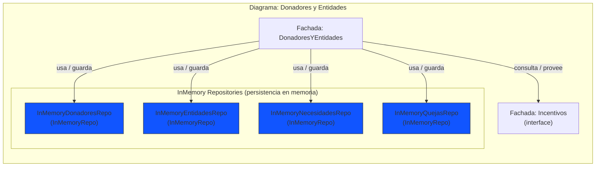

# Diagrama de despliegue

````mermaid
flowchart LR

    %% Cliente
    subgraph NodoCliente["Nodo: Cliente"]
        Cliente[Cliente]
    end

    %% API Gateway
    subgraph NodoAPIGateway["Nodo: API Gateway"]
        APIGateway[API Gateway]
    end

    %% Servicios
    subgraph NodoDonadoresYEntidades["Nodo: Servicio de Donadores y Entidades"]
        DonadoresYEntidades[Servicio de Donadores y Entidades]
    end

    subgraph NodoDonaciones["Nodo: Servicio de Donaciones"]
        Donaciones[Servicio de Donaciones]
    end

    subgraph NodoIncentivos["Nodo: Servicio de Incentivos"]
        Incentivos[Servicio de Incentivos]
    end

    subgraph NodoLogistica["Nodo: Servicio de Logística"]
        Logistica[Servicio de Logística]
    end

    %% Conexiones
    Cliente --> APIGateway
    APIGateway --> Donaciones
    APIGateway --> Logistica
    APIGateway --> Incentivos
    APIGateway --> DonadoresYEntidades
    DonadoresYEntidades  --> Incentivos
````

# Diagrama de componentes

