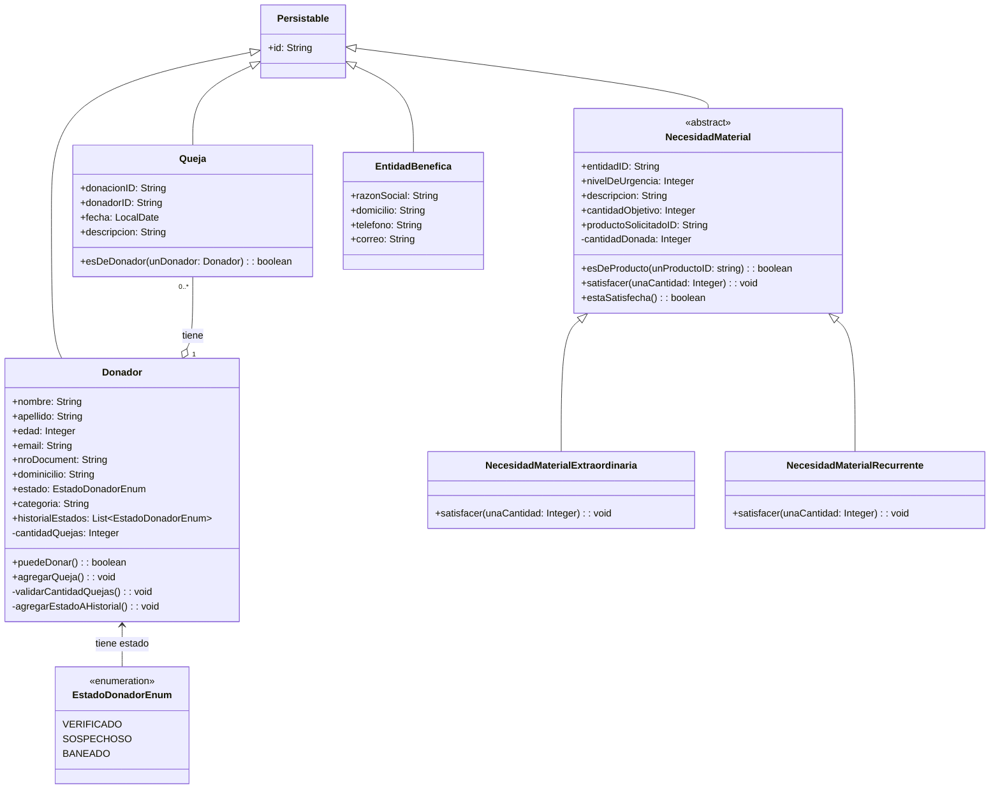

# Diagrama de Clases

```mermaid
classDiagram
	%% Herencia
	Persistable <|-- Donador
	Persistable <|-- Queja
	Persistable <|-- NecesidadMaterial
	Persistable <|-- EntidadBenefica
    NecesidadMaterial <|-- NecesidadMaterialExtraordinaria
    NecesidadMaterial <|-- NecesidadMaterialRecurrente
    Donador <-- EstadoDonadorEnum: tiene estado

	%% Clases y atributos
	class Persistable {
	    
	  +id: String
	}
	
	class EstadoDonadorEnum {
	    <<enumeration>>
	    VERIFICADO
	    SOSPECHOSO
	    BANEADO
    }

	class Donador {
	  +nombre: String
	  +apellido: String
	  +edad: Integer
	  +email: String
	  +nroDocument: String
	  +dominicilio: String
	  +estado: EstadoDonadorEnum
	  +categoria: String
	  +historialEstados: List~EstadoDonadorEnum~
	  -cantidadQuejas: Integer

      +puedeDonar(): boolean
	  +agregarQueja(): void
	  -validarCantidadQuejas(): void
	  -agregarEstadoAHistorial(): void
	}

	class Queja {
	  +donacionID: String
	  +donadorID: String
	  +fecha: LocalDate
	  +descripcion: String

      +esDeDonador(unDonador: Donador): boolean
	}

	class NecesidadMaterial {
	    <<abstract>>
	  +entidadID: String
	  +nivelDeUrgencia: Integer
	  +descripcion: String
	  +cantidadObjetivo: Integer
	  +productoSolicitadoID: String
	  -cantidadDonada: Integer
	  
	  +esDeProducto(unProductoID: string): boolean
	  +satisfacer(unaCantidad: Integer): void
	  +estaSatisfecha(): boolean
	}

    class NecesidadMaterialExtraordinaria {
        +satisfacer(unaCantidad: Integer): void
    }

    class NecesidadMaterialRecurrente {
        +satisfacer(unaCantidad: Integer): void
    }

	class EntidadBenefica {
	  +razonSocial: String
	  +domicilio: String
	  +telefono: String
	  +correo: String 
	}

	%% Asociaciones (multiplicidades aproximadas)
	Queja "0..*" --o "1" Donador : tiene
```